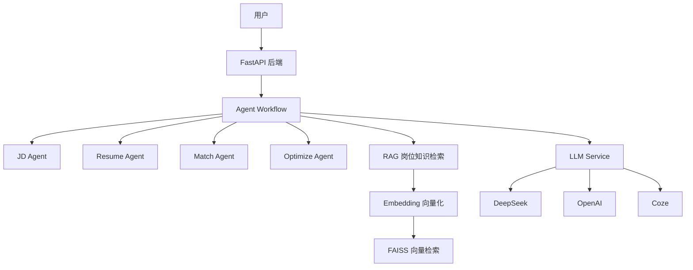
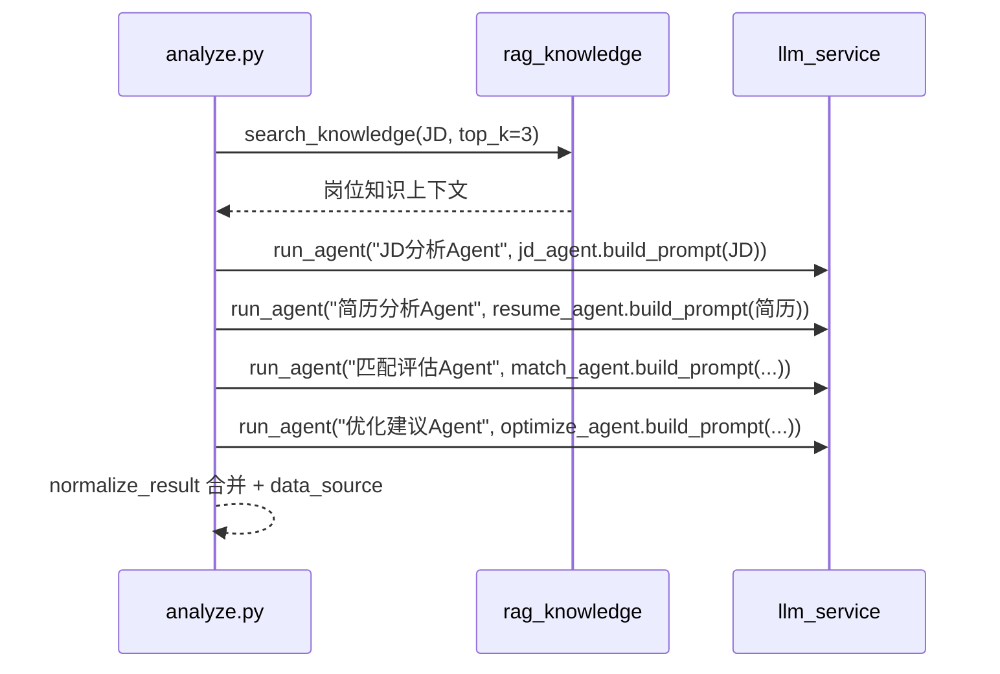

# AI 简历优化助手

基于 **FastAPI** 的智能简历分析服务：上传简历 + 岗位 JD，通过「多 Agent 工作流 + RAG 岗位知识库 + 多 LLM Provider」自动生成岗位匹配评估与简历改写建议。

> 说明：本项目由早期 Node.js + Express 版本迁移而来，原 `server.js` 与根目录 `rag_knowledge.py` 作为历史副本保留，当前运行入口为 `backend/` 下的 FastAPI。

---

## 1. 项目背景

传统简历优化依赖人工润色，效率低且缺乏岗位针对性。本项目将简历分析拆解为多个专业 Agent 协同完成，并引入岗位知识库（RAG）作为外部知识补充，提升匹配评估与改写建议的准确性。同时抽象统一 LLM Provider 层，屏蔽不同大模型供应商的接口差异。

## 2. 核心功能

- **简历输入**：支持直接粘贴文本，或上传 PDF / Word（.docx）文件自动解析。
- **岗位 JD 输入与质量校验**：对 JD 内容做长度、中英文/数字比例、关键词校验。
- **多 Agent 分析工作流**：JD 分析、简历分析、匹配评估、优化建议四个 Agent 顺序协作。
- **RAG 岗位知识检索**：基于向量检索召回岗位知识，注入匹配评估与单 Prompt 上下文。
- **统一 LLM Provider**：DeepSeek（默认）/ OpenAI / Coze 三种 Provider 可切换。
- **异常降级**：Agent 工作流失败时降级到单 Prompt，再失败时返回 mock 兜底数据。
- **前端展示**：FastAPI 同源托管原生 HTML/CSS/JS 页面。

## 3. 系统架构



运行时数据流（与代码一致）：

1. 前端 → `POST /api/analyze`（JSON 或 multipart 表单）。
2. `analyze_resume()` 优先执行多 Agent 工作流 `_run_workflow()`。
3. 工作流先通过 RAG 检索岗位知识，再依次调用 4 个 Agent。
4. 每个 Agent 通过 `LLM Service` 调用所选 Provider，返回结构化 JSON。
5. 合并结果后返回统一响应结构；异常则逐级降级。

## 4. Agent Workflow 流程

入口 [analyze.py](backend/api/analyze.py) 的 `analyze_resume()` → `_run_workflow()`：



| 步骤 | Agent | 输入 | 输出字段 |
|------|-------|------|----------|
| 1 | JD 分析 | 岗位 JD | 岗位职责、核心技能、技术要求、岗位关键词 |
| 2 | 简历分析 | 简历原文 | 技术栈、项目经历、优势、不足 |
| 3 | 匹配评估 | JD 分析 + 简历分析 + 简历原文 + RAG 知识 | match_level、analysis_basis、strengths、weaknesses |
| 4 | 优化建议 | JD 分析 + 匹配结果 + 简历原文 | rewrite_suggestions、optimization_advice |

四个 Agent 各自维护独立 Prompt 模板，位于 [backend/agents/](backend/agents/)。

## 5. RAG 实现流程

实现文件 [backend/rag/rag_knowledge.py](backend/rag/rag_knowledge.py)：

1. **知识库**：[knowledge_base.json](backend/rag/knowledge_base.json) 共 52 条文档，覆盖 `AI应用开发` / `后端开发` / `项目评价标准` / `岗位技能匹配规则` 四类。
2. **Embedding**：使用 ModelScope 中文语义模型 `iic/nlp_gte_sentence-embedding_chinese-small`（512 维，缓存于 `.modelscope/`）。
3. **索引**：`build_index()` 将全部知识文本编码并做 L2 归一化，写入 FAISS `IndexFlatIP`（内积 = 余弦相似度），序列化到 `backend/rag/vector_index/index.faiss` + `meta.json`。
4. **检索**：`search(query, top_k=3)` 对查询向量做同样编码/归一化后检索，返回 `{id, category, content, keywords, score}`。
5. **封装**：`search_knowledge()` 对检索做异常兜底，失败返回空列表，不阻断主流程。

首次运行若索引不存在会自动构建；索引与模型缓存当前已生成。

## 6. LLM Provider 设计

实现文件 [backend/services/llm_service.py](backend/services/llm_service.py)，通过 `LLM_PROVIDER` 环境变量路由：

| Provider | 接口 | 鉴权/配置 |
|----------|------|-----------|
| `deepseek`（默认） | OpenAI 兼容 `/v1/chat/completions` | `DEEPSEEK_API_KEY`、`DEEPSEEK_BASE_URL`、`MODEL_NAME`（默认 `deepseek-chat`） |
| `openai` | OpenAI 兼容 `/v1/chat/completions` | `OPENAI_API_KEY`、`OPENAI_BASE_URL`、`MODEL_NAME`（默认 `gpt-4o-mini`） |
| `coze` | Coze v3 `/v3/chat` 流式（SSE） | `COZE_API_KEY` + `COZE_BOT_ID` |

核心能力：

- `chat(prompt)`：统一入口，返回完整文本；失败向上抛异常。
- 可靠性：`timeout=120s`、`max_retries=3`、指数退避（1s/2s/4s）。
- `run_agent(name, prompt)`：`chat` + JSON 解析，解析失败抛异常触发上层降级。
- `parse_json_from_text()`：支持 ```` ```json ```` 代码块、直接 JSON、首个大括号提取三种解析策略。
- `is_configured()`：按 Provider 检测密钥是否就绪。
- `get_provider()` + `build_data_source()`：动态生成 `{provider}_{kind}` 标识（如 `deepseek_agent_workflow`、`deepseek_llm_api`）。

## 7. Prompt 优化方式

- **角色设定**：每个 Agent 以「你是 XX 专家」开场，明确职责边界。
- **结构化输出约束**：Prompt 内给出完整 JSON Schema 示例，并要求用 ```json 代码块包裹。
- **防编造约束**：
  - `original` 字段必须从简历原文摘录；
  - `basis` 采用「简历原文 + JD 要求 + 改写逻辑」三段式说明；
  - 字符串值避免特殊字符，引用用《》或单引号。
- **上下文分离注入**：匹配评估 Agent 额外注入简历原文与 RAG 知识，减少幻觉。
- **结果后处理**：`normalize_result()` 补全缺失字段、`clean_array_field()` 清洗异常数组项，保证响应结构稳定。

## 8. 异常降级机制

三级降级，保证接口始终返回可用结果：

| 层级 | 触发条件 | data_source |
|------|----------|-------------|
| ① 多 Agent 工作流 | 正常路径 | `{provider}_agent_workflow` |
| ② 单 Prompt | Provider 未配置 / 工作流任一步异常 | 成功时 `{provider}_llm_api` |
| ③ mock 兜底 | 单 Prompt 中 Provider 未配置 / 响应不完整 / LLM 调用异常 | `mock_fallback` |

其它分支：

- JD 质量校验未通过 → `data_source = "invalid_input"`，返回校验原因。
- 文件解析失败 / 参数缺失 → HTTP 400；未知异常 → HTTP 500。

所有 mock 兜底分支均返回统一的 `data_source = "mock_fallback"` 并附带 `warning` 说明。

## 9. 项目目录结构

```
.
├── index.html              # 前端页面（FastAPI 同源托管）
├── style.css
├── script.js
├── render.yaml             # Render 一键部署配置（FastAPI 版）
├── .env.example            # 环境变量模板
├── server.js               # 早期 Node.js 版本（备份，未用于当前运行）
├── rag_knowledge.py        # 早期 RAG 副本（备份，当前运行使用 backend/rag/）
├── package.json            # Node 版依赖（备份，与 FastAPI 无关）
├── backend/
│   ├── main.py             # FastAPI 入口 / 路由 / 静态托管
│   ├── requirements.txt
│   ├── api/
│   │   └── analyze.py      # POST /api/analyze + Agent 编排 + 降级逻辑
│   ├── agents/
│   │   ├── jd_agent.py     # Agent 1：JD 分析
│   │   ├── resume_agent.py # Agent 2：简历分析
│   │   ├── match_agent.py  # Agent 3：匹配评估
│   │   └── optimize_agent.py # Agent 4：优化建议
│   ├── rag/
│   │   ├── rag_knowledge.py   # Embedding + FAISS 检索
│   │   ├── knowledge_base.json # 岗位知识库（52 条）
│   │   └── vector_index/       # 已生成的 FAISS 索引
│   └── services/
│       ├── llm_service.py  # 统一 LLM 调用层
│       └── parser.py       # PDF / Word 解析
└── .venv/                   # Python 虚拟环境
```

## 10. 本地启动方式

```bash
# 1. 安装依赖（backend 目录）
cd backend
..\.venv\Scripts\python.exe -m pip install -r requirements.txt   # Windows
# 或直接：pip install -r requirements.txt

# 2. 配置环境变量（项目根目录，复制模板并填入真实凭证）
copy .env.example .env
# 编辑 .env，至少填入 DEEPSEEK_API_KEY（或其他 Provider 密钥）

# 3. 启动服务（backend 目录，默认 8000 端口）
..\.venv\Scripts\python.exe -m uvicorn main:app --host 0.0.0.0 --port 8000
# 或：python main.py
```

启动后：

- 前端页面：<http://localhost:8000>
- 健康检查：`GET /api/health`
- 分析接口：`POST /api/analyze`

> 首次运行 RAG 会自动通过 ModelScope 下载 embedding 模型（缓存到 `.modelscope/`）并构建 FAISS 索引。索引与模型缓存在本仓库环境中已生成。

## 11. 已验证功能

- FastAPI 服务启动与前端静态页面同源托管（`/`、`/index.html`、`/style.css`、`/script.js`）。
- `GET /api/health` 正常返回 `provider` 与 `llm_configured` 状态。
- `POST /api/analyze` 在 **LLM Provider 未配置** 时返回 `data_source = "mock_fallback"` 与 `warning`。
- `POST /api/analyze` 在 **LLM 调用异常**（重试 3 次失败后）时返回 `data_source = "mock_fallback"` 与 `warning`，日志确认经「多 Agent 失败 → 单 Prompt 失败 → mock 兜底」完整链路。
- RAG 索引构建与检索：`index.faiss` / `meta.json` 已生成，`search` 能正常召回 top-k 岗位知识。
- 动态 `data_source` 命名（`{provider}_{kind}`）不影响前端解析。

## 12. 当前未验证 / 已知限制

- **真实 LLM 调用未验证**：当前未配置任何真实 Provider 凭证（`.env` 尚未创建），因此 4 个 Agent 的真实大模型输出、Agent Workflow 端到端分析内容尚未实测。
- **PDF / Word 解析未做端到端验证**：解析代码（基于 `pypdf` / `python-docx`）已实现，但未上传真实文件验证。
- **RAG 效果未量化评估**：知识召回对最终匹配/改写质量的提升尚未做人工或指标评估。
- **Coze Provider 未实测**：流式接口 `_chat_coze` 保留为备用，当前环境未验证。
- 根目录 `server.js` 与 `rag_knowledge.py` 为历史副本，需注意勿与 `backend/` 下实现混淆。